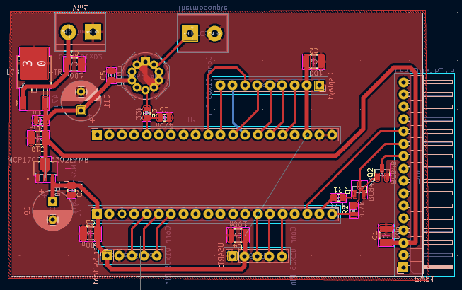

# OvenTemperatureController
Precise oven temperature control for IC evaluation (UCC)

## Hardware

## Software

The PC app is able to control the oven through USB.
You can
 - Create curves and load them to the oven
 - Edit the PID coefficients
 - Start the oven and monitor it

 For instructions on how to build it see the [app readme](software/README.md)
